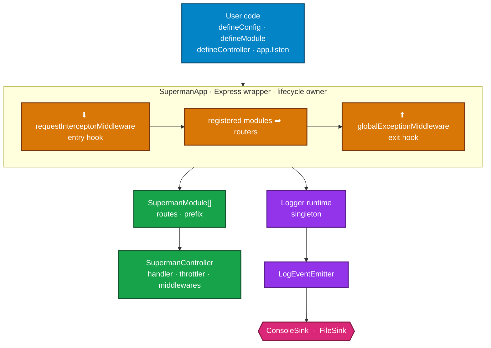
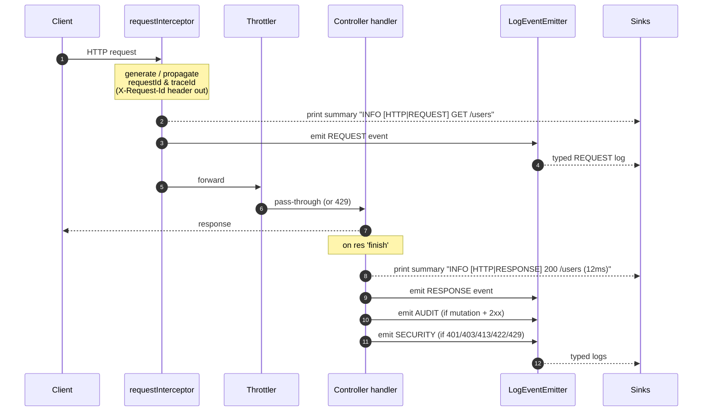
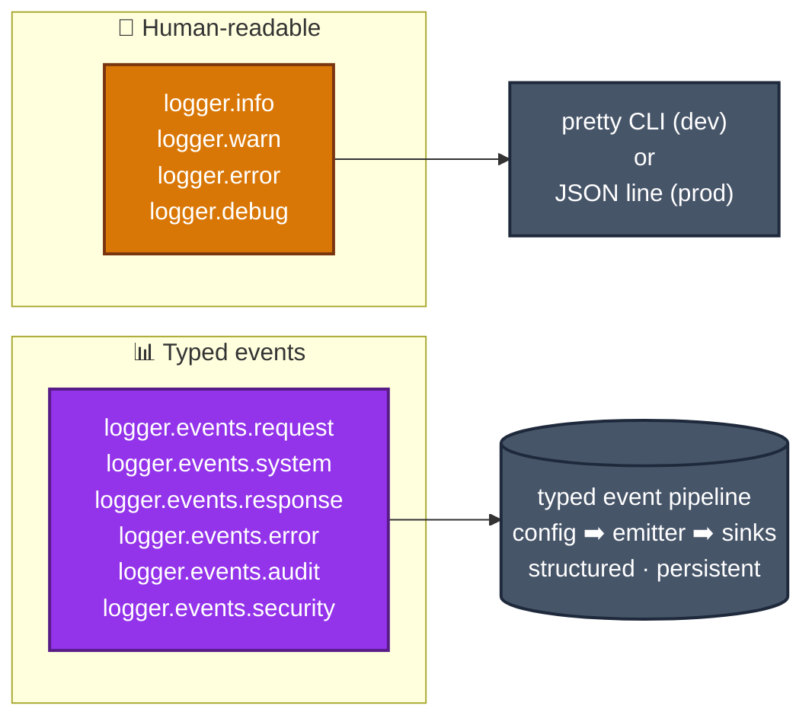
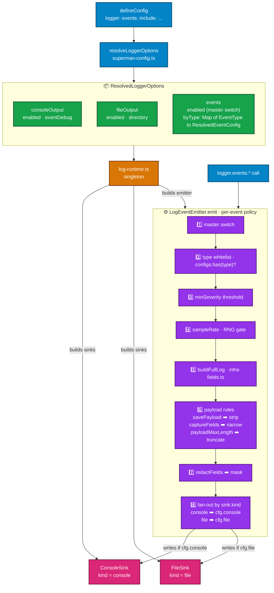

# Architecture

This document describes how `superman` is wired internally — the layers, the lifecycle, and the data flow of structured event logging from `defineConfig` all the way to the console and file sinks.

## 1. Overview

The framework is a thin, opinionated layer on top of Express. It exposes three declarative entry points (`defineConfig`, `defineController`, `defineModule`) and one runtime singleton (`app`). Everything else — request interception, exception handling, structured logging, throttling, graceful shutdown — happens automatically.



### High-level layers

| Layer | Responsibility | Key files |
|---|---|---|
| **App** | Boot, listen, graceful shutdown, signal handlers, module registration | [src/app/superman-app.ts](../src/app/superman-app.ts) |
| **Core** | Module/controller primitives + declarative factories | [src/core/](../src/core/) |
| **Config** | `defineConfig` singleton resolver | [src/config/superman-config.ts](../src/config/superman-config.ts) |
| **Middlewares** | Request interception, global exception handling | [src/middlewares/](../src/middlewares/) |
| **Logger** | Structured event pipeline (emitter ➡️ sinks) + dev console logger | [src/logger/](../src/logger/) |
| **Exceptions** | `HttpException` hierarchy, error response shape | [src/exceptions/](../src/exceptions/) |
| **Throttle** | Per-controller rate limiting + presets | [src/throttle/](../src/throttle/) |

## 2. Principles

The framework rests on four design rules that shape every module:

1. **Declarative over imperative.** Apps are described in three function calls (`defineConfig`, `defineModule`, `defineController`); the framework wires the Express plumbing. No middleware chains to trace, no manual error handling, no router boilerplate.

2. **Depend on interfaces, not implementations.** Controllers receive service interfaces; services receive repository/gateway interfaces. The `defineController<TService>` generic enforces this — see [docs/principles.md](./principles.md).

3. **Cross-cutting concerns are auto-applied.** Logging, error handling, throttling, request IDs, and graceful shutdown are framework-owned. User code never imports these; it just throws `HttpException` and emits events through `logger.events.*`.

4. **Structure is observable and machine-readable.** The app produces a single `/spec` endpoint returning a valid OpenAPI 3.1 document built from route metadata. Every event is a typed JSON object that matches a `*Log` interface. No drift between code and docs.

## 3. Application lifecycle

### Boot sequence (`app.listen()`)

[src/app/superman-app.ts](../src/app/superman-app.ts) drives this in order:

1. `defineConfig({…})` — synchronous, populates the config singleton (port, prefix, env, logger options). Pending modules accumulate in a queue.
2. `app.listen()` calls `ensureInit()`:
   - Mounts `cors`, `express.json({ limit })` based on resolved config.
   - Drains the pending-module queue via `flushPendingModules()`.
   - For each module: `register()` ➡️ resolves routes, applies module middlewares, mounts under `/${config.prefix}/${module.prefix}`.
   - Mounts the single global `/spec` route that serves the OpenAPI 3.1 document.
   - Mounts `globalExceptionMiddleware` last (Express requires error middleware after routes).
3. Installs `SIGTERM` / `SIGINT` handlers (idempotent).
4. Emits a `SYSTEM` event (`SERVICE_STARTED`).
5. Calls `httpServer.listen(port)`.

### Request lifecycle

Every request enters through [requestInterceptorMiddleware](../src/middlewares/request-interceptor.middleware.ts):



If the handler throws, control flows to [globalExceptionMiddleware](../src/middlewares/global-exception.middleware.ts):

- `HttpException` ➡️ status from `err.statusCode`, body `{ error, metadata? }`. Emits `ERROR` event only when severity is ERROR-class (5xx + 400/422). 4xx-WARN responses log via `log.warn` but skip the typed event.
- Unknown `Error` ➡️ 500 + `Internal Server Error`. Always emits `ERROR` event with stack trace.

### Shutdown sequence

`SIGTERM` / `SIGINT` triggers `shutdown()`:

1. Emits `SYSTEM` event (`SYSTEM_SIGNAL_RECEIVED`).
2. Calls `module.destroy()` on every registered module (cleans up DB pools, intervals, message brokers).
3. Calls `closeLogRuntime()` ➡️ flushes file streams.
4. `process.exit(0)`.

## 4. Logger and event pipeline

This is the largest subsystem. Three separate concerns live in [src/logger/](../src/logger/):

### 4.1 Two logger surfaces



`SupermanLogger` ([src/logger/superman-logger.ts](../src/logger/superman-logger.ts)) is the human-friendly logger — colorized stdout in dev, JSON-per-line in prod, with `LOG_LEVEL` env override. `logger.events` lazily binds to a shared `LogEventEmitter` per context.

The rest of this section follows the **typed event** path because it's where the configurability lives.

### 4.2 Data flow: config ➡️ emitter ➡️ sinks



### 4.3 Configuration (`defineConfig.logger`)

[src/config/superman-config.ts](../src/config/superman-config.ts) accepts:

```typescript
defineConfig({
  logger: {
    consoleOutput: {
      enabled: true,
      eventDebug: true,        // pretty JSON bodies in dev console
    },
    fileOutput: {
      enabled: true,
      directory: 'logs',       // resolved relative to cwd if not absolute
    },
    events: {
      enabled: true,           // master switch
      include: [
        { type: 'SYSTEM',   savePayload: true,  payloadMaxLength: 1000 },
        { type: 'ERROR',    savePayload: true,  payloadMaxLength: 2000 },
        { type: 'REQUEST',  savePayload: true,  payloadMaxLength: 1000 },
        { type: 'RESPONSE', savePayload: true,  payloadMaxLength: 1000 },
        { type: 'SECURITY', savePayload: true,  payloadMaxLength: 2000 },
        { type: 'AUDIT',    savePayload: true,  payloadMaxLength: 2000 },
      ],
    },
  },
});
```

Per-event options (each optional, with sensible default):

| Option | Default | Purpose |
|---|---|---|
| `type` | — (required) | `'SYSTEM' \| 'ERROR' \| 'REQUEST' \| 'RESPONSE' \| 'AUDIT' \| 'SECURITY'` |
| `savePayload` | `true` | When `false`, strips heavy fields (`requestBody`, `query`, `metadata`, `stackTrace`, `changes`) |
| `payloadMaxLength` | `5000` | Per-field char cap; longer values get `…[truncated]` |
| `console` | `true` | Per-event opt-out of console sink |
| `file` | `true` | Per-event opt-out of file sink |
| `minSeverity` | `'INFO'` | Drop events below threshold (`INFO < WARN < ERROR < SECURITY < FATAL`) |
| `captureFields` | `[]` | Inclusive whitelist applied recursively inside payload objects only — only listed keys survive |
| `redactFields` | `[]` | Recursively mask matching keys with `'***'` (whole log object) |
| `sampleRate` | `1` | Probabilistic sampling 0..1 — useful for high-volume types in prod |

The resolver validates input synchronously: unknown `type`, unknown `minSeverity`, non-integer/negative `payloadMaxLength`, and out-of-range `sampleRate` all throw at boot.

**Config defaults when omitted:**
- Omit `events` entirely ➡️ all six types enabled with default options.
- Omit `events.include` (but keep `events`) ➡️ still all six with defaults.
- Events not listed in `include` are dropped (whitelist semantics).
- `events.enabled: false` is a hard kill switch above per-type config.

### 4.4 Runtime (`log-runtime.ts`)

[src/logger/log-runtime.ts](../src/logger/log-runtime.ts) holds the singleton state lazily built on first `logger.events.*` access. It:

1. Reads the resolved config (or fallback defaults if `defineConfig` was never called — useful for unit tests of consumer code).
2. Creates a `ConsoleSink` if `consoleOutput.enabled` and `NODE_ENV !== 'test'`.
3. Creates a `FileSink` if `fileOutput.enabled` and `NODE_ENV !== 'test'`.
4. Returns a function that builds a per-context `LogEventEmitter` reusing the same sinks and `byType` map.

`closeLogRuntime()` is invoked on shutdown to flush file streams; `resetLogRuntime()` exists for test isolation.

### 4.5 Emitter (`log-event-emitter.ts`)

[src/logger/log-event-emitter.ts](../src/logger/log-event-emitter.ts) — the only place per-event policy executes. The flow inside `emit()`:

1. **Master switch**: `if (!options.enabled) return;`
2. **Type whitelist**: `const cfg = configs.get(eventType); if (!cfg) return;`
3. **Severity threshold**: drop when `SEVERITY_RANK[partial.severity] < SEVERITY_RANK[cfg.minSeverity]`.
4. **Sampling**: drop when `cfg.sampleRate < 1 && rng() >= cfg.sampleRate` (RNG injectable for deterministic tests).
5. **Build full log** via `buildFullLog()` (infra fields like `@timestamp`, `appName`, `serverInstanceUid`, `hostname`, `uptimeMs`, `memoryUsage`, `cpuUsage` from [infra-fields.ts](../src/logger/infra-fields.ts) — merged with the user payload).
6. **Payload rules** (`applyPayloadRules`) per event-specific payload-field set:
   - `SYSTEM` / `RESPONSE` / `SECURITY`: `metadata`
   - `ERROR`: `stackTrace`, `metadata`
   - `REQUEST`: `requestBody`, `query`, `metadata`
   - `AUDIT`: `changes`, `metadata`

   The order is: strip-if-not-savePayload ➡️ captureFields whitelist ➡️ JSON serialize ➡️ truncate to `payloadMaxLength`.
7. **Redaction**: `applyRedaction` walks the **whole** log recursively, replacing matched keys with `'***'`.
8. **Sink fan-out**: for each registered sink, skip if `sink.kind === 'console'` and `!cfg.console`, or if `sink.kind === 'file'` and `!cfg.file`. Otherwise `sink.write(log)`.

`LogEventEmitter.child(context)` clones the emitter with a new context label — used by `logger.child('HTTP')`, `logger.child('Exception')`, etc.

### 4.6 Sinks (`ILogSink`)

[src/logger/log-sink.ts](../src/logger/log-sink.ts) declares the contract:

```typescript
type SinkKind = 'console' | 'file';

interface ILogSink {
  readonly kind: SinkKind;        // routing tag — read by emitter
  write(log: FullLog): void;
  close?(): Promise<void>;
}
```

The `kind` tag is what enables per-event `console` / `file` opt-outs without writing two parallel sink lists.

#### ConsoleSink

[src/logger/console-sink.ts](../src/logger/console-sink.ts) — destination depends on `NODE_ENV`:

- **Production** ➡️ one JSON line per event (`JSON.stringify(log)\n`). ERROR/FATAL severity routes to `stderr`, everything else to `stdout`. Always emits, regardless of `eventDebug`.
- **Development** ➡️ if `eventDebug: true`, emits the pretty-formatted JSON body. For events where the request interceptor / exception middleware already prints a summary line (`REQUEST`, `RESPONSE`, `ERROR`, `SECURITY`), the sink emits **body only** to avoid duplication. For `SYSTEM` and `AUDIT` it emits header + summary + body. If `eventDebug: false` (default) the sink stays silent in dev — the summary lines from the interceptor/exception middleware still render.

#### FileSink

[src/logger/file-sink.ts](../src/logger/file-sink.ts) — one append-mode write stream per event type per UTC day:

- Filename pattern: `{event-suffix}-YYYY-MM-DD.log` (e.g. `request-logs-2026-04-29.log`).
- Suffixes come from `LogIndexSuffix` in [superman-logger.types.ts](../src/logger/superman-logger.types.ts).
- Streams are cached in a `Map<EventType, CachedStream>`; rolled over automatically when the date tag changes.
- On any write/stream error, the sink **disables itself** (sets `disabled = true`, ends all streams) and reports via `onError` so a broken disk doesn't crash the request path.
- `close()` ends all streams and clears the cache.

### 4.7 Six event types

[src/logger/superman-logger.types.ts](../src/logger/superman-logger.types.ts) defines `EventType` (enum + literal alias `EventTypeName`) and the six log shapes (all extending `BaseLog` with infra fields):

| Event | Fires when | Shape |
|---|---|---|
| `SYSTEM` | Service start, manual shutdown, signals received | `SystemLog` |
| `REQUEST` | Every incoming HTTP request | `RequestLog` |
| `RESPONSE` | Every completed HTTP response | `ResponseLog` |
| `ERROR` | Every caught exception (HTTP and runtime) | `ErrorLog` |
| `AUDIT` | Successful mutations: POST/PUT/PATCH/DELETE with 2xx | `AuditLog` |
| `SECURITY` | 401, 403, 413, 422, 429 responses (auto-mapped) | `SecurityLog` |

`REQUEST`, `RESPONSE`, `AUDIT`, `SECURITY` are emitted automatically by the request interceptor — application code never calls them. `ERROR` is emitted automatically by the global exception middleware. `SYSTEM` is emitted by the framework at lifecycle points and may also be emitted by application code for domain-level system events.

The mapping logic — HTTP method ➡️ `AuditEvents`, HTTP status ➡️ `SecurityEvents` — lives in [log-builders.ts](../src/logger/log-builders.ts).

## 5. Throttling

[src/throttle/](../src/throttle/) provides per-controller rate limiting using a sliding window. Each `defineController` accepts `throttleConfig` (preset name or custom `{ limit, ttl }`):

| Preset | Limit | TTL |
|---|---|---|
| `SECURITY` | 5 | 60s |
| `STRICT` | 10 | 60s |
| `STANDARD` (default) | 100 | 60s |
| `PERMISSIVE` | 1 000 | 60s |
| `EXTRA_PERMISSIVE` | 10 000 | 60s |

When the limit is exceeded, the framework throws `TooManyRequestsException` (429) — which feeds back into the security event pipeline (`RATE_LIMIT_EXCEEDED`).

## 6. Test boundaries

The framework auto-disables file output and the console sink when `NODE_ENV === 'test'` ([log-runtime.ts](../src/logger/log-runtime.ts)). This keeps unit tests of consumer code silent without forcing every test to mock out the logger. The emitter still runs (so behaviour assertions remain possible); it just has no sinks attached.

For framework-level tests, `resetLogRuntime()` clears the singleton between tests, and `LogEventEmitter` accepts an injected `rng` for deterministic sampling assertions.

## 7. File reference

| Concern | File |
|---|---|
| Environment resolution (`ENV` ➡️ `NODE_ENV` ➡️ `'development'`) | [src/config/resolve-environment.ts](../src/config/resolve-environment.ts) |
| Boot, listen, shutdown | [src/app/superman-app.ts](../src/app/superman-app.ts) |
| Module declaration | [src/core/define-module.ts](../src/core/define-module.ts), [superman-module.ts](../src/core/superman-module.ts) |
| Controller declaration | [src/core/define-controller.ts](../src/core/define-controller.ts), [superman-controller.ts](../src/core/superman-controller.ts) |
| Request entry hook | [src/middlewares/request-interceptor.middleware.ts](../src/middlewares/request-interceptor.middleware.ts) |
| Exception exit hook | [src/middlewares/global-exception.middleware.ts](../src/middlewares/global-exception.middleware.ts) |
| Config singleton + resolver | [src/config/superman-config.ts](../src/config/superman-config.ts) |
| Human logger (SupermanLogger) | [src/logger/superman-logger.ts](../src/logger/superman-logger.ts) |
| Event emitter + per-event policy | [src/logger/log-event-emitter.ts](../src/logger/log-event-emitter.ts) |
| Runtime singleton (sinks + emitter wiring) | [src/logger/log-runtime.ts](../src/logger/log-runtime.ts) |
| Sink contract | [src/logger/log-sink.ts](../src/logger/log-sink.ts) |
| Console sink | [src/logger/console-sink.ts](../src/logger/console-sink.ts) |
| File sink | [src/logger/file-sink.ts](../src/logger/file-sink.ts) |
| Event type definitions | [src/logger/superman-logger.types.ts](../src/logger/superman-logger.types.ts) |
| Auto-mapping logic (status ➡️ security/audit) | [src/logger/log-builders.ts](../src/logger/log-builders.ts) |
| Infra fields builder | [src/logger/infra-fields.ts](../src/logger/infra-fields.ts) |
| Pretty formatting helpers | [src/logger/pretty-formatter.ts](../src/logger/pretty-formatter.ts) |
| Exception hierarchy | [src/exceptions/http.exception.ts](../src/exceptions/http.exception.ts) |
| Throttle presets + impl | [src/throttle/](../src/throttle/) |
