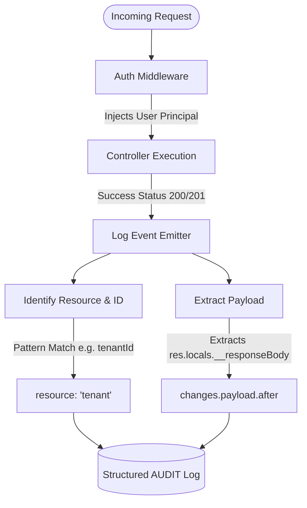

# Security Logging and Events

Security isn't just about blocking access; it's about visibility. Superman provides a dedicated `log.events.security()` function that emits highly structured security logs.

These logs integrate effortlessly with SIEM solutions (like Datadog, Splunk, or Elasticsearch) because they strictly adhere to the framework's semantic typing.

```typescript
import { logger, SecurityEvents, EventSeverity, AuthOutcome } from '@supersec-ai/superman';

const log = logger.child('Auth');

export const loginHandler = async ({ body, req }) => {
  const user = await findUser(body.email);
  
  if (!user || user.password !== hash(body.password)) {
    log.events.security({
      securityEvent: SecurityEvents.LOGIN_FAILED,
      eventSeverity: EventSeverity.WARN,
      authOutcome: AuthOutcome.DENIED,
      securityMessage: `Failed login attempt for email: ${body.email}`,
      ip: req.ip,
      traceId: req.headers['x-trace-id']
    });
    throw new UnauthorizedError();
  }
  
  // ... success logic
};
```

By standardizing events like `SecurityEvents.LOGIN_FAILED`, `TOKEN_EXPIRED`, or `SUSPICIOUS_INPUT_DETECTED`, your team can build reliable alerts without parsing raw text logs.

---

## Audit Logs and Resource IDs

In the context of the Superman framework's structured logging, `resourceId` is a specific field on the `AuditLog` object designed to track exactly *which* entity was acted upon.

Here is a visual breakdown of how the framework automatically handles an Audit Event lifecycle:



### Why it matters for Audit Logs

When you send logs to a system like Elasticsearch, Datadog, or AWS CloudWatch, security and compliance teams need to be able to trace the lifecycle of a specific record.

For example, if an admin updates a user's permissions, the framework emits an audit log like this:

```json
{
  "@timestamp": "2026-05-23T14:40:12.345Z",
  "eventType": "AUDIT",
  "eventSeverity": "INFO",
  "appName": "superman-api",
  "appVersion": "1.0.0",
  "environment": "production",
  "serverInstanceUid": "srv_8f93j2kd",
  "hostname": "api-gateway-01",
  "uptimeMs": 349120,
  "memoryUsage": 128456000,
  "cpuUsage": 4.5,
  "context": "Mcp",
  "requestId": "req_847294",
  "auditEvent": "USER_PERMISSIONS_CHANGED",
  "userRoles": ["ADMIN"],
  "auditMessage": "User permissions were modified by the system admin",
  "resource": "user",
  "resourceId": "usr_8923bca",
  "changes": {
    "payload": {
      "after": {
        "id": "usr_8923bca",
        "email": "admin@example.com",
        "roles": ["ADMIN"]
      }
    }
  }
}
```

By having `resourceId` as a dedicated indexable field, your compliance team can easily search: *"Show me every single audit event that happened to the user with ID usr_8923bca"*.

### How it applies to the MCP Server

When an AI agent (like Claude Desktop) calls an MCP tool, it's essentially acting on your system.

If the agent calls a tool named `lookup_customer` with the arguments `{ "customerId": "cust_123" }`, the framework's internal `auditMcpRequest` logic intercepts this. It notices the `customerId` argument and automatically tags the audit log with `resourceId: "cust_123"`.

This guarantees that if you search your company's logs for `cust_123`, you will see not only when human admins touched that customer, but also exactly when an AI agent executed an MCP tool against them!

### Is it configurable?

Yes! By default, the framework smartly scans both standard HTTP request payloads (`req.params`, `req.body`, `req.query`) and MCP tool arguments for any key that contains common identifier patterns (e.g. `id`, `code`, `uuid`, etc.).

If it finds a matching key (like `tenantId` or `customerCode`), it automatically assigns its value to `resourceId`. Even better, it gracefully extracts the prefix to use as the `resource` name (e.g., `tenantId` sets the resource name to `tenant`!). If nothing matches, it elegantly falls back to using the URL path and `req.params.id`.

If your domain uses different nomenclature, you can easily add custom patterns to the framework globally in your `server.config.ts`. These will be combined with the defaults!

```typescript
// src/server.config.ts
import { defineConfig } from '@supersec-ai/superman';

defineConfig({
  logger: {
    events: {
      audit: {
        // The framework will scan payload keys for the default patterns AND your custom ones!
        resourceIdPatterns: ['email', 'username', 'ssn', 'urn'] 
      }
    }
  }
});
```

### Automatic Auditing Edge Cases

While the automated pipeline covers the vast majority of standard CRUD applications seamlessly, there are two edge cases to keep in mind:

1. **Non-RESTful Mutations:** The framework relies on strict HTTP semantic mapping (`POST` -> `201`, `PUT`/`PATCH` -> `200/204`, `DELETE` -> `200/204`). If you have a custom action endpoint like `POST /users/123/suspend` that returns `200 OK`, the framework won't automatically emit an audit event. You will need to manually call `log.events.audit()` for these bespoke actions.
2. **Multiple Matching IDs:** If a request payload contains multiple ID keys (e.g., both `tenantId` and `userId`), the framework's pattern scanner will attribute the audit log to the *first* matching key it scans.

---

## Configuring Events and Payload Storage

As your application scales, storing the full HTTP request and response payloads for every single interaction can quickly consume massive amounts of disk space and log storage budgets.

Superman allows you to finely tune what gets logged and how it gets logged via the `logger.events` configuration.

### Disabling Payload Storage

If you want to track that a request occurred (for metrics or rate-limiting visibility) but want to drop the potentially large payload body, you can explicitly set `savePayload: false` for specific event types:

```typescript
// src/server.config.ts
import { defineConfig, EventType } from '@supersec-ai/superman';

defineConfig({
  logger: {
    events: {
      include: [
        { type: EventType.REQUEST, savePayload: true },
        // Track the response status/time, but drop the heavy JSON response body!
        { type: EventType.RESPONSE, savePayload: false },
        { type: EventType.AUDIT, savePayload: true },
        { type: EventType.SECURITY, savePayload: true }
      ]
    }
  }
});
```

### Tracking Changes Safely (Without Storing Payloads)

If you turn off payload storage for network events, how do you track what a user actually modified in your system? 

Instead of relying on parsing huge, raw HTTP `body` objects, you should utilize the `changes` field inside a structured **AUDIT** event! This ensures you only record the exact, meaningful delta of what changed in your domain, keeping your logs small, compliant, and highly readable.

```typescript
// Inside your controller or service
log.events.audit({
  auditEvent: AuditEvents.USER_UPDATED,
  resource: 'user',
  resourceId: user.id,
  auditMessage: 'User profile was updated',
  changes: {
    email: {
      before: 'old@example.com',
      after: 'new@example.com'
    }
  }
});
```

By combining `savePayload: false` for generic HTTP logs with precise `changes` tracking in Audit events, you achieve the ultimate balance of deep observability and highly efficient disk space management!
