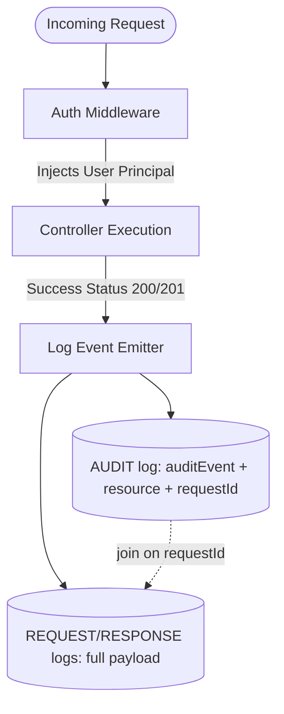

# Security Logging and Events

Security isn't just about blocking access; it's about visibility. Superman provides a dedicated `log.events.security()` function that emits highly structured security logs.

These logs integrate effortlessly with SIEM solutions (like Datadog, Splunk, or Elasticsearch) because they strictly adhere to the framework's semantic typing.

```typescript
import { logger, SecurityEvents, EventSeverity, AuthOutcome } from '@supersec-ai/superman';

const log = logger.child('Auth');

export const loginHandler = async ({ body, req }) => {
  const user = await findUser(body.email);
  
  if (!user || user.password !== hash(body.password)) {
    log.events.security({
      securityEvent: SecurityEvents.LOGIN_FAILED,
      eventSeverity: EventSeverity.WARN,
      authOutcome: AuthOutcome.DENIED,
      securityMessage: `Failed login attempt for email: ${body.email}`,
      ip: req.ip,
      traceId: req.headers['x-trace-id']
    });
    throw new UnauthorizedError();
  }
  
  // ... success logic
};
```

By standardizing events like `SecurityEvents.LOGIN_FAILED`, `TOKEN_EXPIRED`, or `SUSPICIOUS_INPUT_DETECTED`, your team can build reliable alerts without parsing raw text logs.

---

## Audit Logs and Correlation

The `AuditLog` is a **correlation-only event marker**. It records *that* an action
happened on a resource type, by whom, and a `requestId` — it deliberately does
**not** store the affected entity id or a payload/diff. The mutated data lives on
the correlated `REQUEST` / `RESPONSE` logs, which you join to the audit entry by
their shared `requestId`.

Here is how the framework handles an Audit Event lifecycle:



### Why correlation instead of a payload field

When you send logs to Elasticsearch, Datadog, or AWS CloudWatch, security and
compliance teams trace a record's lifecycle by `requestId`: find the AUDIT event,
then pull the `REQUEST` / `RESPONSE` logs that share its `requestId` for the full
before/after payload. The audit trail stays small and tamper-evident; the heavy
data lives once, on the request/response logs.

For example, when an admin updates a user's permissions, the framework emits an
audit log like this:

```json
{
  "@timestamp": "2026-05-23T14:40:12.345Z",
  "eventType": "AUDIT",
  "eventSeverity": "INFO",
  "appName": "superman-api",
  "appVersion": "1.0.0",
  "environment": "production",
  "serverInstanceUid": "srv_3f2a9c8e-1b4d-4e7a-9c2f-6d5b8a1e0f33",
  "hostname": "api-gateway-01",
  "uptimeMs": 349120,
  "memoryUsage": 128456000,
  "cpuUsage": 4.5,
  "context": "Mcp",
  "requestId": "req_7c1e5d92-4a8b-4f3c-bd6a-2e9f0c4a7b18",
  "auditEvent": "USER_PERMISSIONS_CHANGED",
  "userRoles": ["ADMIN"],
  "auditMessage": "User permissions were modified by the system admin",
  "resource": "user"
}
```

To see *what* changed, search the `REQUEST` / `RESPONSE` logs for
`requestId: "req_7c1e5d92-4a8b-4f3c-bd6a-2e9f0c4a7b18"`.

### How it applies to the MCP Server

When an AI agent (like Claude Desktop) calls an MCP tool, it acts on your system.
The framework's `auditMcpRequest` logic emits a correlation-only audit event for
that call; the tool arguments themselves live in the correlated `REQUEST` log,
joinable via `requestId`.

### Automatic Auditing Edge Case

The framework relies on strict HTTP semantic mapping (`POST` -> `201`,
`PUT`/`PATCH` -> `200/204`, `DELETE` -> `200/204`). If you have a custom action
endpoint like `POST /users/123/suspend` that returns `200 OK`, the framework
won't automatically emit an audit event — call `log.events.audit()` manually for
these bespoke actions.

---

## Configuring Events and Payload Storage

As your application scales, storing the full HTTP request and response payloads for every single interaction can quickly consume massive amounts of disk space and log storage budgets.

Superman allows you to finely tune what gets logged and how it gets logged via the `logger.events` configuration.

### Disabling Payload Storage

If you want to track that a request occurred (for metrics or rate-limiting visibility) but want to drop the potentially large payload body, you can explicitly set `savePayload: false` for specific event types:

```typescript
// src/server.config.ts
import { defineConfig, EventType } from '@supersec-ai/superman';

defineConfig({
  logger: {
    events: {
      include: [
        { type: EventType.REQUEST, savePayload: true },
        // Track the response status/time, but drop the heavy JSON response body!
        { type: EventType.RESPONSE, savePayload: false },
        { type: EventType.AUDIT, savePayload: true },
        { type: EventType.SECURITY, savePayload: true }
      ]
    }
  }
});
```

### Keeping audit change-detail under lean request logging

Because the audit log carries no payload of its own, "what changed" is recovered
from the correlated `REQUEST` / `RESPONSE` bodies. So if you set
`savePayload: false` on `REQUEST`, the change detail is stripped and becomes
unrecoverable — the audit line still proves the action happened, but not the
values.

To stay safe, the framework applies one targeted rule: **when the `AUDIT` event
keeps its payload (`savePayload: true`, the default), the `REQUEST` log retains
its `requestBody` for mutating methods (POST/PUT/PATCH/DELETE) even when the
`REQUEST` event's own `savePayload` is `false`.** It keys off the HTTP method
(the request log is emitted before the status is known), so a mutating request
that ends in a 4xx also keeps its body — a safe over-retention. Set the `AUDIT`
event's `savePayload` to `false` to opt out entirely.

This gives you the balance: drop noisy non-mutating bodies, while every auditable
mutation keeps a recoverable record correlated by `requestId`.
